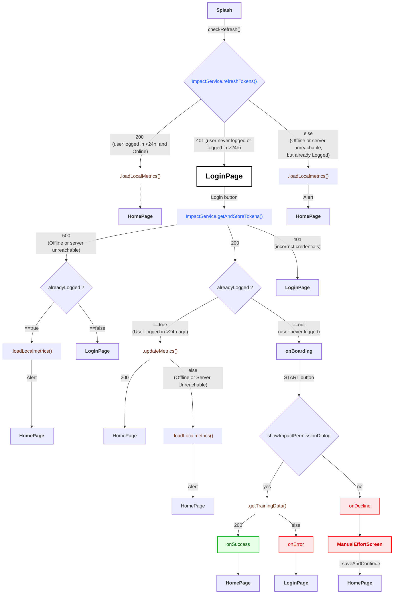
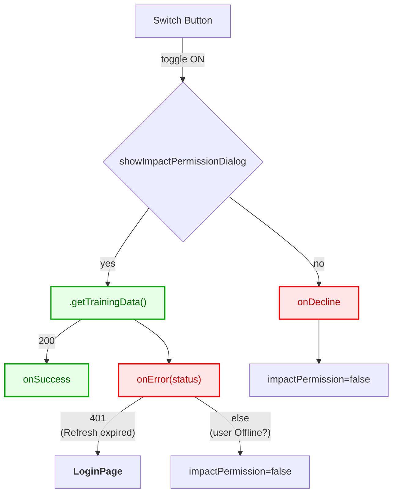
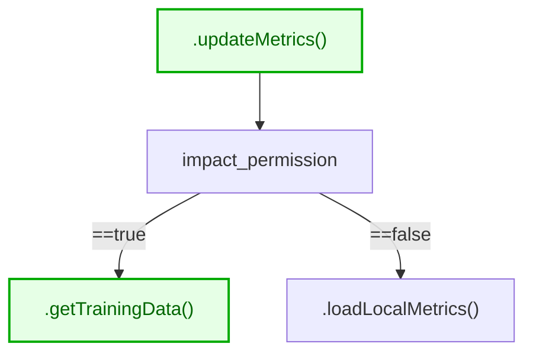

## Application Architecture and Business Logic

### 1. App Lifecycle & Authentication Flow

```mermaid
flowchart TB
    Splash["`**Splash**`"] -- checkRefresh() --> RefreshCheck{"ImpactService.refreshTokens()"}
    RefreshCheck -- 200 \n(user logged in <24h, and Online) --> SaveAccess[".loadLocalMetrics()"]
    SaveAccess -.-> HomePage["`**HomePage**`"]
    RefreshCheck -- 401 (user never logged or logged in >24h) --> ToLogin["`**LoginPage**`"]
    ToLogin -- Login button --> CallImpact["ImpactService.getAndStoreTokens()"]
    CheckOnboarding{"alreadyLogged ?"} -- "==true\n(User logged in >24h ago)" --> GoHome[".updateMetrics()"]
    onboarding["`**onBoarding**`"] -- START button --> dialog{"showImpactPermissionDialog"}
    ManualSetup["`**ManualEffortScreen**`"] -- _saveAndContinue --> GoHome2["HomePage"]
    dialog -- yes --> FetchData[".getTrainingData()"]
    FetchData -- 200 --> SuccessFetch["onSuccess"]
    SuccessFetch --> GoHome3["HomePage"]
    FetchData -- else --> ErrorFetch["onError"]
    ErrorFetch --> ManualSetup2["`**LoginPage**`"]
    CheckOnboarding -- "==null\n(user never logged)" --> onboarding
    RefreshCheck -- "else\n(Offline or server unreachable,\nbut already Logged)" --> n11[".loadLocalmetrics()"]
    n11 -- Alert --> n12["`**HomePage**`"]
    CallImpact -- "500\n(Offline or server unreachable)" --> n13{"alreadyLogged ?"}
    CallImpact -- 200 --> CheckOnboarding
    CallImpact -- "401\n(incorrect credentials)" --> n14["`**LoginPage**`"]
    GoHome -- 200 --> n19["HomePage"]
    GoHome -- "else\n(Offline or Server Unreachable)" --> n20[".loadLocalmetrics()"]
    n13 -- "==true" --> n22[".loadLocalmetrics()"]
    n22 -- Alert --> n23["`**HomePage**`"]
    n13 -- "==false" --> n24["`**LoginPage**`"]
    n20 -- Alert --> n25["HomePage"]
    dialog -- no --> n26["onDecline"]
    n26 --> ManualSetup

    %% Classi di Stile
    classDef success fill:#e6ffe6,stroke:#00aa00,color:#006600,stroke-width:2px
    classDef error fill:#ffe6e6,stroke:#ff0000,color:#cc0000,stroke-width:2px
    classDef boldOnly font-weight:bold,stroke-width:2px

    %% Assegnazione Stili ai Nodi
    class Splash,HomePage,onboarding,GoHome2,GoHome3,ManualSetup2,n14,n23,n24 boldOnly
    class SaveAccess,GoHome,FetchData,SuccessFetch success
    class ToLogin,ManualSetup,ErrorFetch error

    %% Stili personalizzati inline
    style RefreshCheck color:#2962FF
    style SaveAccess color:#6d331a,stroke:#00C853,stroke-width:0px,fill:transparent
    style ToLogin color:#000000,stroke:#000000,fill:transparent,font-size:24px
    style CallImpact color:#2962FF,stroke:none
    style GoHome stroke:none,fill:transparent,color:#6d331a
    style FetchData color:#6d331a,stroke-width:0px,fill:transparent
    style n11 color:#6d331a,stroke-width:0px
    style n20 stroke:none,color:#6d331a
    style n22 stroke:none,color:#6d331a
    style n26 color:#D50000,stroke:#D50000,fill:#ffe6e6
```

---

### 2. Managing the Switch Tracker (Settings)

```mermaid
flowchart TB
    switchBtn["Switch Button"] -- toggle ON --> dialog{"showImpactPermissionDialog"}
    
    %% Ramo YES
    dialog -- yes --> getTraining[".getTrainingData()"]
    getTraining -- 200 --> onSuccess["onSuccess"]
    getTraining --> onError["onError(status)"]
    
    onError -- "401\n(Refresh expired)" --> login["<b>LoginPage</b>"]
    onError -- "else\n(user Offline?)" --> permFalse1["impactPermission=false"]
    
    %% Ramo NO
    dialog -- no --> onDecline["onDecline"]
    onDecline --> permFalse2["impactPermission=false"]

    %% Stili personalizzati
    classDef success fill:#e6ffe6,stroke:#00aa00,color:#006600,stroke-width:2px
    classDef error fill:#ffe6e6,stroke:#ff0000,color:#cc0000,stroke-width:2px
    
    class getTraining,onSuccess success
    class onError,onDecline error
```

---

### 3. Metrics Update Logic

```mermaid
flowchart TB
    update[".updateMetrics()"] --> perm["impact_permission"]
    perm -- "==true" --> get[".getTrainingData()"]
    perm -- "==false" --> load[".loadLocalMetrics()"]

    %% Stili personalizzati
    classDef success fill:#e6ffe6,stroke:#00aa00,color:#006600,stroke-width:2px
    class update,get success
```
